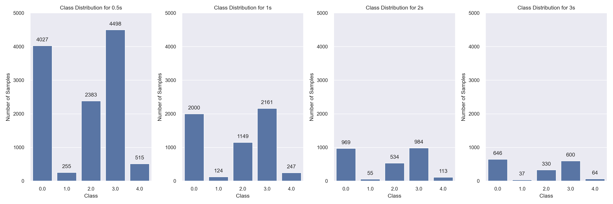
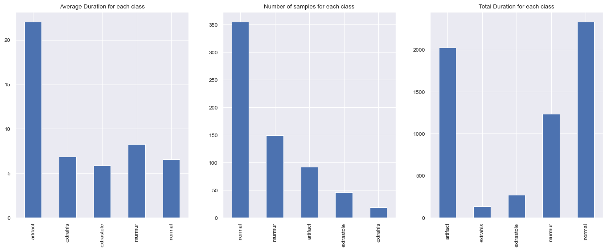

## Features Engineering Notes
---

After the features extraction, we can see the classes are **not balanced**. The figure below shows the distribution of the classes.

**What's the reason for this?**
To figure it out we need to look at how the features are extracted:
- Each audio is divided into segments of x seconds, let's say 1 second.
- For each segment, we extract the features, let's say 26 features.

As a result, we have a matrix of shape (n_segments, n_features) for each audio, that represents our datapoint.
The longer the audio, the more segments we have, and the more datapoints we have.
The situation is shown in the figure below.

**How can we balance the classes?**
We can follow to strategies, not mutually exclusive:
- **A Priori Balancing**: We can work on the raw audio, prior to the features extraction, and balance the classes by cutting the audio, removing outliers or performing data augmentation.
- **A Posteriori Balancing**: We can work on the features, after the extraction, and balance the classes by exploiting oversampling and/or undersampling techniques.

